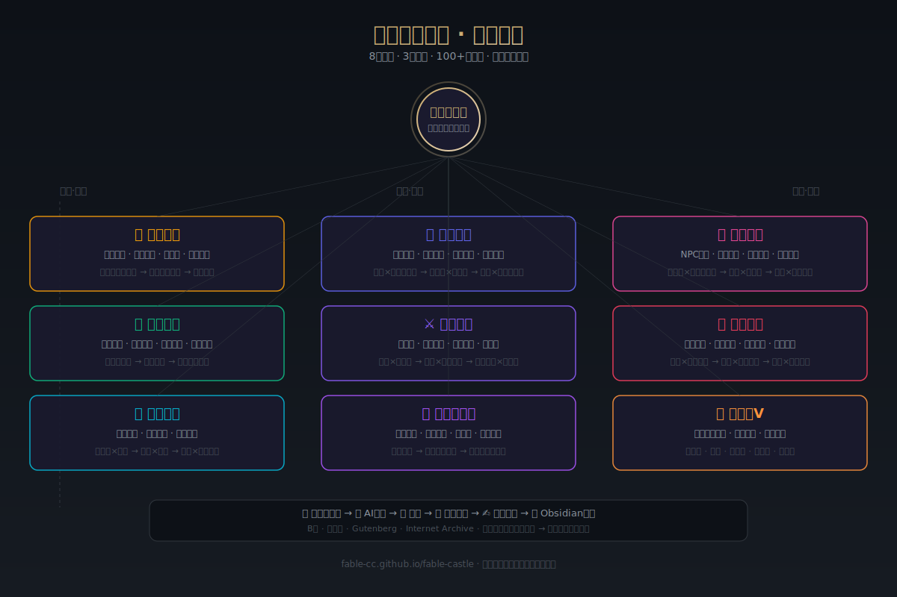

<p align="center">
  <a href="https://fable-cc.github.io/fable-castle"></a>
  <a href="https://github.com/fable-cc/fable-cc"></a>
  <a href="https://github.com/fable-cc/knowledge-pipeline"></a>
  <a href="https://github.com/fable-cc/fable-castle/discussions/1"></a>
  
  
</p>

# 🌳 景一·寓言城堡

> **不是搬运工，是冶炼者。**
> 国学×心理学×隐学×商业实战 → 人性底层代码。
> 帮你觉醒意识、看懂规则、落地搞钱。

🌐 **在线寓言城堡**：[fable-cc.github.io/fable-castle](https://fable-cc.github.io/fable-castle/)

---

## 🎯 一句话定位

**看过底层规则的人，帮你觉醒 + 搞钱 + 升级认知。跨赛道融合者。**

---

## 🗺️ 全景架构

<p align="center">
  
</p>

---

## 🧠 核心三大支柱（完美闭环）

```
        钱途心法（落地变现）
        /                    \
       /      完美闭环        \
      /                        \
   暗流规则（权力博弈）——— 意识觉醒（景一·本源升维）
```

| 支柱 | 维度 | 核心命题 |
|------|------|---------|
| **钱途心法** | 景一·落地变现 | 搞钱心法、人情世故、执行力、转运法则 |
| **暗流规则** | 景一·权力博弈 | 信息封锁、强势文化、人性秘术、权力结构 |
| **意识觉醒** | 景一·本源升维 | NPC觉醒、系统设计、意识升级、维度思维 |

**三者闭环**：看见规则 → 觉醒意识 → 落地执行。

**完整体系 → [18支柱全景](./02-知识图谱/扩展体系全景.md)**（核心3+扩展10+基础5）

---

## 🗺️ 寓言城堡导航

| 目录 | 内容 | 适合谁 |
|------|------|--------|
| [01-方法论](./01-方法论/) | 知识冶炼框架、跨赛道融合心法 | 想理解我如何思考 |
| [02-知识图谱](./02-知识图谱/) | 三大支柱核心精炼 | 想系统学习底层规则 |
| [03-内容样本](./03-内容样本/) | 精选公开内容、金句卡片 | 想看成品质量 |
| [04-关于](./04-关于/) | 赞助支持、深度合作 | 想一起搞事情 |

---

## 🔥 为什么是"冶炼者"而不是"搬运工"

市面上大部分人做的事：把别人的内容换个说法讲一遍。

我做的事：
- **向下挖**：穿透到人性底层，找到3000年不变的东西
- **横向连**：国学能解释搞钱 → 不是国学牛，是人性没变过
- **向上建**：把矿石（钱途心法/暗流规则/意识觉醒的输入）冶炼成景一的金子

**内容公式不是 A×B×C，而是：从人性出发，自然穿透所有领域。**

---

## ⚡ 内容纪律

- 生拉硬拽 = 垃圾。两个领域没有底层人性共通点，就不融
- 每条洞察必须能让人"确实如此"，不是"你在说什么"
- 正确的废话不收。没有信息量的金句不收
- 每条都要有可操作性——看完知道怎么做

---

## 🌐 全平台内容矩阵

| 平台 | 内容形态 | 链接 |
|------|---------|------|
| 抖音 | 60s 口播/剪辑 | @景一 |
| 小红书 | 图文卡片/深度帖 | @景一 |
| B站 | 长视频/专题系列 | @景一 |
| 公众号 | 深度长文/金句合集 | 景一说 |
| **GitHub** | **知识框架/方法论开源** | **你在这里** |

> GitHub 是我的"专业身份证"——所有方法论和框架在此公开可验证。

---

## 🤝 支持与赞助

如果这里的知识对你有启发：

- ⭐ **Star** 这个仓库，让更多人看到
- 💰 **[GitHub Sponsors](./.github/FUNDING.yml)** — 赞助支持持续创作
- 📬 **深度合作** → 见 [04-关于/深度合作](./04-关于/深度合作.md)

---

## 📜 许可

本仓库内容采用 [CC BY-NC-SA 4.0](./LICENSE) 许可。
- ✅ 署名转载、非商业使用
- ❌ 商业用途需授权
- 🔗 衍生作品需相同方式共享

---

<p align="center">
  <b>从人性出发，自然穿透所有领域。</b><br>
  <sub>Made with 🔥 by 景一 · 2024</sub>
</p>


